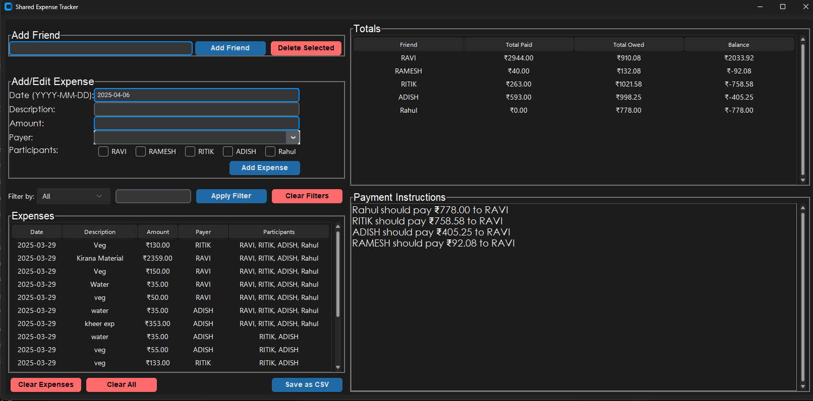

# expenses-manager
A Python-based desktop app to manage expenses and budgets with friend-splitting feature.

# 💰 Expenses Manager

A simple and efficient **Expenses Manager** app to track daily spending, manage monthly budgets, and split costs with friends. Built with Python and CustomTkinter (desktop version). Future releases may include support for Android using React Native!

---

## 🚀 Features

- 📆 Track daily and monthly expenses
- 🧾 Add custom expense details (amount, date, purpose, etc.)
- 👥 Add friends and split expenses fairly
- 📊 View total expenses and remaining monthly balance
- 📁 Data is stored locally for offline use
- 🗃️Filter feature

---

## 🛠️ Tech Stack

- **Language:** Python
- **GUI Framework:** CustomTkinter
- **Planned Mobile Version:** React Native (for Android)

---

## 📷 Screenshots

 
UI:
> 
